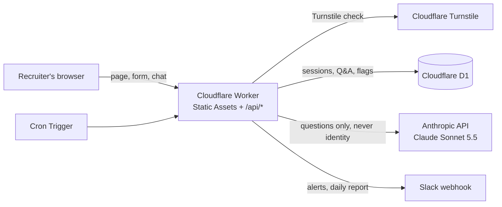

# Profile agent — Emeline Zitte

A conversational "queryable profile" for recruiters. My projects were run internally on confidential client data, so I can't show them: this agent documents them instead, from facts I have validated, and says so when something isn't documented.

Designed and built with Claude Code. Full write-up (stack choices, rules, safeguards, data handling, limits): [`public/construction.en.md`](public/construction.en.md) · version française : [`public/construction.fr.md`](public/construction.fr.md), also served on the site as "How this agent is built".

Live agent: `[link to be added]`

## Architecture



- **One Cloudflare Worker** serves the static page (plain HTML/CSS/JS) and the API: `/api/session`, `/api/chat` (streaming), `/api/delete`, plus read-only content routes.
- **Content lives in Markdown** in [`content/`](content/): `profile.md` and `faq.md` (the facts), `system-prompt.md` (the rules and interface texts), `politique-confidentialite.md` (privacy policy). The model receives the profile and FAQ in full, with prompt caching.
- **Tools given to the model:** `get_overlap` (time zone overlap computed in code with IANA zones), `report_unanswered` (flags gaps and manipulation attempts to Slack), and the API's web search for salary ranges only.
- **Server-side guardrails:** atomic 9-question counter, call invitation after answers 3 and 6, rate limiting on a hashed IP, Turnstile, signed HttpOnly cookie, 60-second timeout per model call, Anthropic server-side fallback, 90-day automatic deletion.

## Repository layout

| Path | Content |
|---|---|
| `content/` | Profile, FAQ, system prompt, privacy policy (source of truth) |
| `public/` | Chat page, privacy page, "how it's built" page, English labels for FAQ buttons |
| `src/index.js` | Router and scheduled task entry point |
| `src/chat.js` | `/api/chat`: prompt, streaming, tool loop, server-added messages |
| `src/session.js`, `src/security.js` | Entry form, signed cookie, IP fingerprint, Turnstile, data deletion |
| `src/overlap.js`, `src/tools.js` | Time zone tool and tool definitions |
| `src/slack.js`, `src/scheduled.js` | Slack alerts, daily report, purge |
| `migrations/` | D1 schema |
| `scripts/eval.mjs` | Test suite against the real model (costs API credits) |
| `scripts/export.mjs` | CSV export of all questions |
| `test/` | Automated tests of the time zone tool |

## Run it locally

Prerequisites: Node.js and a Cloudflare account.

```bash
npm install
npx wrangler login
npx wrangler d1 migrations apply profile-agent-db --local
```

Create a `.dev.vars` file (ignored by Git) with:

```
ANTHROPIC_API_KEY=...
COOKIE_SECRET=...            # long random string
TURNSTILE_SECRET_KEY=1x0000000000000000000000000000000AA   # Cloudflare test key
SLACK_WEBHOOK_URL=...        # optional; without it, alerts are printed in the logs
SLACK_DRY_RUN=false          # optional; "true" prints alerts instead of sending them
```

Then:

| Command | What it does |
|---|---|
| `npm run dev` | Starts the agent at http://localhost:8787 |
| `npm test` | Time zone tool tests (free) |
| `npm run eval -- --limit=5` | Test suite on 5 questions (calls the model: costs credits) |
| `npm run eval` | Full test suite: FAQ, out-of-scope questions, manipulation attempts |
| `npm run export` | CSV of all questions from the production database |

Trigger the daily report locally while `npm run dev` is running: open `http://localhost:8787/cdn-cgi/handler/scheduled?cron=*+*+*+*+*`.

## Configuration

Non-secret variables are in [`wrangler.jsonc`](wrangler.jsonc): `MODEL`, `EFFORT`, `FALLBACKS`, `MAX_QUESTIONS`, `CALL_INVITE_AT`, `RETENTION_DAYS`, `REPORT_HOUR`, `REPORT_TZ`, `NOTIFY_NEW_SESSION`, `SLACK_DRY_RUN`, `SLACK_USER_ID`, `TURNSTILE_SITE_KEY`.

Production secrets are set with `npx wrangler secret put <NAME>`: `ANTHROPIC_API_KEY`, `COOKIE_SECRET`, `TURNSTILE_SECRET_KEY`, `SLACK_WEBHOOK_URL`. No key, webhook or secret is ever committed.

---

## En français

Agent conversationnel « profil consultable » pour les recruteurs : il documente mes projets, menés en interne sur des données clients confidentielles, à partir de faits que j'ai validés, et renvoie vers moi quand un point n'est pas documenté. Conçu et construit avec Claude Code. Le détail des choix techniques, des règles, des garde-fous, du traitement des données et des limites est dans [`public/construction.fr.md`](public/construction.fr.md), aussi publié sur le site sous le titre « Comment cet agent est construit ».
